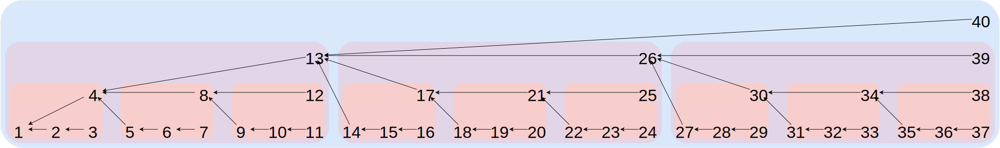

# It Starts With a Message...

The most important protocol concept is that of the "message".
In their most simple form, Pigeon protocol messages are just ASCII text documents. They are human readable and can even be created by hand in a text editor, though most clients will provide better means of authoring messages.

Below is an example of such a message:

```
author @MF312A76JV8S1XWCHV1XR6ANRDMPAT2G5K8PZTGKWV354PR82CD0.ed25519
kind weather_report
prev %ZV85NQS8B1BWQN7YAME1GB0G6XS2AVN610RQTME507DN5ASP2S6G.sha256
depth 3
lipmaa 2

temperature:"22.0C"
webcam_photo:&FV0FJ0YZADY7C5JTTFYPKDBHTZJ5JVVP5TCKP0605WWXYJG4VMRG.sha256
weather_reported_by:@0DC253VW8RP4KGTZP8K5G2TAPMDRNA6RX1VHCWX1S8VJ67A213FM.ed25519

signature JSPJJQJRVBVGV52K2058AR2KFQCWSZ8M8W6Q6PB93R2T3SJ031AYX1X74KCW06HHVQ9Y6NDATGE6NH3W59QY35M58YDQC5WEA1ASW08.sig.ed25519
```

Let's explore each line of a message.

### Line 1: `author`

EXAMPLE:

```
author @MF312A76JV8S1XWCHV1XR6ANRDMPAT2G5K8PZTGKWV354PR82CD0.ed25519
```

The first line of a Pigeon message header is the `author` entry.

Every Pigeon database has an "identity". An identity is an ED25519 key pair that prevents tampering by parties other than the database owner. An identity is publicly referenced using a "multihash". In the example above, the identity multihash was `@MF312A76JV8S1XWCHV1XR6ANRDMPAT2G5K8PZTGKWV354PR82CD0.ed25519`.

The steps to generate a valid identity are:

1. Perform [Crockford Base32 encoding](https://www.crockford.com/base32.html) on an ED25519 public key.
2. Add an `@` symbol to the beginning of the string from step 1.
3. Add a `.ed25519` string to the end of the string from step 2.

### Line 2: `kind`

EXAMPLE:

```
kind weather_report
```

The second line of the header is the `kind` entry. This entry is user definable. The `kind` entry is used as a means of signalling intent to applications that will consume the message.

It must meet the following criteria:

 * Must be 1-90 characters in length
 * Cannot contain whitespace or control characters
 * May contain any of the following characters:
    * alphanumeric characters
    * dashes (`-`)
    * underscores (`_`)
    * Symbols used for multihashes, such as `@`, `&` and `%` (covered later).

### Line 3: `prev`

EXAMPLE:

```
prev %ZV85NQS8B1BWQN7YAME1GB0G6XS2AVN610RQTME507DN5ASP2S6G.sha256
```

A Pigeon message feed is a unidirectional chain of documents where the newest document points back to the document that came before it in the chain ([example diagram](diagram1.png)).

To create this chain, a Pigeon message uses the `prev` field. The `prev` field contains a message multihash. In this case, the multihash is `%ZV85NQS8B1BWQN7YAME1GB0G6XS2AVN610RQTME507DN5ASP2S6G.sha256`.

Messages are content addressed. This is in contrast to protocols such as HTTP which use names to identify resources. Because Pigeon messages are addressed by content rather than by name, changing a message's content, even by just one character, has the effect of completely changing the message's multihash.

**For the first message of a feed, this value is set to `NONE`.**

Message multihashes are calculated as follows:

1. The first character is a `%` symbol, indicating that it is a `message` rather than an `identity`, `blob` or `string`.
2. The next 52 characters are a [Crockford base 32](https://www.crockford.com/base32.html) SHA512 hash of the previous message's content.
3. The message multihash ends in `.sha512`.

### Line 4: `depth`

EXAMPLE:

```
depth 3
```

Pigeon messages exist in a linear sequence which only moves forward and never "forks".
Every message has a `depth` field to indicate its "place in line".
Because every message has an ever-increasing integer that never duplicates, every message in a Pigeon feed will have a unique hash. This is true even if messages have identical body content.

### Line 5: `lipmaa`

**THIS FIELD WAS WRITTEN INCORRECTLY. THIS WILL CHANGE SOON. YOU CAN SAFELY MOVE TO THE NEXT SECTION OF THE DOCS**

This concept was borrowed from the [Bamboo protocol](https://github.com/AljoschaMeyer/bamboo#links-and-entry-verification) and [Helger Lipmaa's thesis](https://kodu.ut.ee/~lipmaa/papers/thesis/thesis.pdf).

EXAMPLE:

```
lipmaa 2
```

The `lipmaa` field (often called a "Lipmaa Link") is a special kind of `depth` field that allows partial verification of feeds. This field makes it possible to verify a single message (or subset of messages) without downloading the entire chain of messages.



The `lipmaa` field is calculated as follows:

```ruby
def lipmaa(n)
  # The original lipmaa function returns -1 for 0
  # but that does not mesh well with our serialization
  # scheme. Comments welcome on this one.
  return 0 if n < 1 # Prevent -1, division by zero etc..

  m, po3, x = 1, 3, n
  # find k such that (3^k - 1)/2 >= n
  while (m < n)
    po3 *= 3
    m = (po3 - 1) / 2
  end
  po3 /= 3
  # find longest possible back-jump
  if (m != n)
    while x != 0
      m = (po3 - 1) / 2
      po3 /= 3
      x %= m
    end
    if (m != po3)
      po3 = m
    end
  end
  return n - po3
end
```

### Line 6: Empty carriage return (body start)
### Lines 7: Entry containing a string
### Lines 8: Entry referencing a blob
### Lines 9: Entry referencing a peer's identity
### Lines 10: Empty Carriage Return (footer start)
### Lines 11: Signature Line
### Lines 12: Empty Carriage Return (message end)
# Sharing Messages and Blobs via Bundles
# Glossary of Terms

**This list is out of date.** Numerous changes and problems were addressed in the implementation of a client. We will update this list in May of 2020.

 * Header
 * Blob
 * Crockford Base32
 * NONE
 * String
 * Signature
 * Value
 * Message
 * Blob Hash
 * Key
 * Pair
 * Footer
 * Bundle
 * Kind
 * Message Signature
 * Feed
 * Identity


# Running a CLI Client

Pigeon currently has one CLI available. It is written in Ruby. Documentation can be found [here](https://tildegit.org/PigeonProtocolConsortium/pigeon_ruby)

# Up Next

This concludes the developer documentation. Please email us with questions. To learn more, continue to the [idea bin](IDEAS.md).
