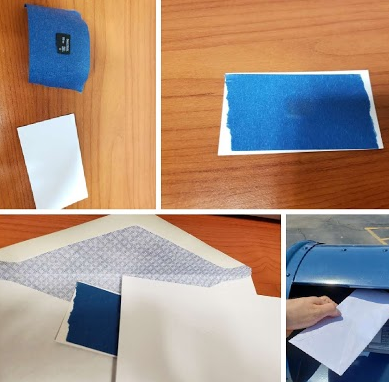

# Pigeon

A synchronizing peer-to-peer messaging protocol that is:

 * replicated among peers
 * tamper-resistant
 * delay tolerant (assumes sneakernet is the default transport layer)

The document below describes a protocol as it _should be_ rather than as it is. This document does not describe a working protocol. It is a planning document for a protocol and the first software package that will implement the protocol.

# How It Works

You synchronize with peers via sneakernet or any other high-delay, high-throughput medium.



# Prior Art

This is an exploration of ideas set forth by the Secure Scuttlebutt protocol. It is my opinion that SSB is one of the most innovative protocols created in recent years. Without the research and efforts of the SSBC, this project would not be possible, so a big thanks goes out to all the people who make SSB possible.

I've also been inspired by the compactness and minimalism of [SQLite, which should serve as a role model for all of us](https://www.sqlite.org/talks/wroclaw-20090310.pdf).

# The Protocol Design Should...

 * Have [near] zero config. We will allow a limit of 10 configuration options for all eternity. These are simple key/value pairs. No nesting, no namespacing, no dots, no dashes, no nested configs, no arrays, none of that crap. Seriously, I'm watching you.
 * Offer a portable and interchangeable format for application developers

# Protocol Vs. Implementation Vs. Application

In the specification below, the terms "protocol", "implementation" and "application" will be used frequently.

The **protocol** is a document that specifies a set of guidelines that implementors must follow when authoring a Pigeon Protocol implementation. Analogy: HTTP is a protocol. [RFC 2616](https://tools.ietf.org/html/rfc2616) is its specification.

An **implementation** is a software library (not an application) that implements the Pigeon protocol specification. Example: HTTP is a protocol. LibCurl and LibHTTP are HTTP implementations.

An **application** is software that uses a Pigeon Protocol implementation, possibly augmenting the protocol with additional functionality. Example: HTTP is a protocol. Netscape Navigator is an HTTP application.

# The Initial Implementation Should...

 * Allow for importing/exporting to SSB via plugins.
 * Assume CPU and RAM are not plentiful.
 * Assume platform has no networking support. No startups, shutdowns, or reboots
 * Assume storage is plentiful when making resource allocation tradeoffs.
 * Be filesystem agnostic. Persistence mechanisms are implementation-specific.
 * Be Secure
 * Easily be ported to new platforms and languages.
 * Enable "Free listening"
 * Have a formal specification (reference implementations are not OK).
 * Have no singletons (no signing authorities, no servers of any kind, even locally)
 * Minimize conceptual overhead (If it's not needed at least 80% of the time, don't add it).
 * Offline-first. Assume the user will never have TCP or UDP access.
 * Prefer a monolithic internal structure. Avoid external dependencies except for limited use cases (Eg: crypto libs)
 * Use a compact serialization format that is deterministic and easy to parse on constrained end devices.

# Constraints, Assumptions

 * Assume there are no connections or network (file/blob first)
 * Assume CPU resources and memory are limited.
 * Assume block storage is plentiful (storage space measured in GBs)

# The Gauntlet

 * Create an implementation in multiple languages, one of which is WASM compatible
 * patchwork clone
 * SSB importer / exporter
 * GUI database browser
 * reddit/newsgroup clone
 * File sharing app
 * turn-based board game
 * Messenger type app
 * Sync over sneakernet (using common Unix utilities and default features)
 * Sync over email (via external tool)
 * Sync over bluetooth (via external tool)
 * FireFox log viewer extension, similar to Patchfox
 * Transmit Pigeon Protocol bundles over actual pigeons, possibly soliciting help from world famous boxer and pigeon racing enthusiast Mike Tyson.

# Unanswered Questions

 * Ephemeral key exchange
 * Merkle tree vs. hash chain

# Concepts

 * Base64: This project uses standard base64 encoding, as defined in [RFC 4648](https://tools.ietf.org/html/rfc4648). The protocol always uses the standard "=" character for padding.
 * Identity: A base64 `ed25519` public key starting with `@` and ending with `.ed25519`.
 * Signature: An ED25519 signature starting with a `%` and end with `.sha256`.
 * String: A 1..62 byte list of ASCII characters, Starting and ending with `"`.
 * Blob: arbitrary binary data over 62 bytes in length, currently limited to 1 MB max.
 * Hash: A base64'ed SHA256 of a Blob, starting with `&` and ending with `.sha256`.
 * Attribute: A term to collectively describe `string`s, and `hash`es.
 * Pair: two attributes (see definition above) joined with a `:` between the two.
 * Body: A special attribute and reserved word.
 * Message: A document with an author, prev, depth, kind, mandatory body and an arbitrary set of attribute pairs.
 * Feed: A linked collection of messages.
 * Null Signature: An ASCII `0` character, used to indicate the first message in a feed (discussed later)
 * Bundle: A specially crafted binary archive sent from one peer directly to another peer for the sake of synchronizing and gossiping feeds. Bundles are intricate and require their own document, found [here](bundles.md)

# What a Message Looks Like

```
author: @ajgdylxeifojlxpbmen3exlnsbx8buspsjh37b/ipvi=.ed25519
depth: 23
kind: &82244417f956ac7c599f191593f7e441a4fafa20a4158fd52e154f1dc4c8ed92.sha256
prev: %85738f8f9a7f1b04b5329c590ebcb9e425925c6d0984089c43a022de4f19c281.sha256

"foo":&3f79bb7b435b05321651daefd374cdc681dc06faa65e374e38337b88ca046dea.sha256
&3e23e8160039594a33894f6564e1b1348bbd7a0088d42c4acb73eeaed59c009d.sha256:"bar"
&ca978112ca1bbdcafac231b39a23dc4da786eff8147c4e72b9807785afee48bb.sha256:&2e7a0bc31f3c4fe6114051c3a56c8ed8a030b3b394df7d29d37648e9b8cbf54b.sha256
"baz":"whatever"
```

# How It Works

```bash

pigeon status
# => BLOBS: 10,234
# => PEERS: 26
# => VERSION: 0.0.1
# => FOO: BAR

pigeon identity new
# => @ajgdylxeifojlxpbmen3exlnsbx8buspsjh37b/ipvi=.ed25519

pigeon identity show
# => @ajgdylxeifojlxpbmen3exlnsbx8buspsjh37b/ipvi=.ed25519


pigeon blob set '"Lol, data"'
# => &2e7a0bc31f3c4fe6114051c3a56c8ed8a030b3b394df7d29d37648e9b8cbf54b.sha256

# Or use pipes for big files:
echo "Lol, data" | pigeon blob set
# => &2e7a0bc31f3c4fe6114051c3a56c8ed8a030b3b394df7d29d37648e9b8cbf54b.sha256
cat "pigeon.jpg" | pigeon blob set
# => &2e7a0bc31f3c4fe6114051c3a56c8ed8a030b3b394df7d29d37648e9b8cbf54b.sha256


pigeon blob get "&2e7a0bc31f3c4fe6114051c3a56c8ed8a030b3b394df7d29d37648e9b8cbf54b.sha256"
# => "Lol, data"

pigeon message new weather_report
# => "Commiting existing message `%jvK...zGM=.sha256`.
# => "Starting new message of kind `weather_report`.

pigeon message current # Show active log entry.
# => author: @ajgdylxeifojlxpbmen3exlnsbx8buspsjh37b/ipvi=.ed25519
# => depth: 1
# => kind: weather_report
# => prev: %jvKh9yoiEJaePzoWCF1nnqpIlPgTk9FHEtqczQbvzGM=.sha256
# =>
# =>

pigeon message append --name=2e7a0bc3 --value=2e7a0bc3
# => \n
# => This needs to be cleaner.
# => No one likes the way it is right now.
# => We will come back to this monstrosity later.

pigeon message save
# => author: @ajgdylxeifojlxpbmen3exlnsbx8buspsjh37b/ipvi=.ed25519
# => depth: 1
# => kind: &82244417f956ac7c599f191593f7e441a4fafa20a4158fd52e154f1dc4c8ed92.sha256
# => prev: %jvKh9yoiEJaePzoWCF1nnqpIlPgTk9FHEtqczQbvzGM=.sha256
# =>
# => &ca978112ca1bbdcafac231b39a23dc4da786eff8147c4e72b9807785afee48bb.sha256:&2e7a0bc31f3c4fe6114051c3a56c8ed8a030b3b394df7d29d37648e9b8cbf54b.sha256
# =>

pigeon message find %g0Fs9yoiEJaePzoWCF1nnqpIlPgTk9FHEtqczQbvzGM=.sha256
# => author: @ajgdylxeifojlxpbmen3exlnsbx8buspsjh37b/ipvi=.ed25519
# => depth: 1
# => kind: &82244417f956ac7c599f191593f7e441a4fafa20a4158fd52e154f1dc4c8ed92.sha256
# => prev: %jvKh9yoiEJaePzoWCF1nnqpIlPgTk9FHEtqczQbvzGM=.sha256
# =>
# => &ca978112ca1bbdcafac231b39a23dc4da786eff8147c4e72b9807785afee48bb.sha256:&2e7a0bc31f3c4fe6114051c3a56c8ed8a030b3b394df7d29d37648e9b8cbf54b.sha256
# =>

pigeon message find-all --author=@ajgdylxeifojlxpbmen3exlnsbx8buspsjh37b/ipvi=.ed25519 --since=1
# => author: @ajgdylxeifojlxpbmen3exlnsbx8buspsjh37b/ipvi=.ed25519
# => depth: 1
# => kind: &82244417f956ac7c599f191593f7e441a4fafa20a4158fd52e154f1dc4c8ed92.sha256
# => prev: %jvKh9yoiEJaePzoWCF1nnqpIlPgTk9FHEtqczQbvzGM=.sha256
# =>
# => &ca978112ca1bbdcafac231b39a23dc4da786eff8147c4e72b9807785afee48bb.sha256:&2e7a0bc31f3c4fe6114051c3a56c8ed8a030b3b394df7d29d37648e9b8cbf54b.sha256
# =>
# => author: @ajgdylxeifojlxpbmen3exlnsbx8buspsjh37b/ipvi=.ed25519
# => depth: 2
# => kind: &82244417f956ac7c599f191593f7e441a4fafa20a4158fd52e154f1dc4c8ed92.sha256
# => prev: %jvKh9yoiEJaePzoWCF1nnqpIlPgTk9FHEtqczQbvzGM=.sha256
# =>
# => &ca978112ca1bbdcafac231b39a23dc4da786eff8147c4e72b9807785afee48bb.sha256:&2e7a0bc31f3c4fe6114051c3a56c8ed8a030b3b394df7d29d37648e9b8cbf54b.sha256
# =>

pigeon peer add @m0LEP+0NrGqu1wT8/4a3nOPuRBM+DrMpUahDZ3/cDi8=.ed25519
# =>

pigeon peer remove @78daXMc/BOq5F1RWLMN4zgPVBVLqA4ShkLgE6z9OUGQ=.ed25519
# =>

pigeon peer block @GOl+398b2kWeLi6+DCcU0i3AWD6vWmUtocBVYbpkpNk=.ed25519
# =>

pigeon peer all
# => @c8hovH5OOzNJ1SXUsIN+zI23xMcvGdEbs3ZJgzpthrw=.ed25519
# => @GOl+398b2kWeLi6+DCcU0i3AWD6vWmUtocBVYbpkpNk=.ed25519
# => @m0LEP+0NrGqu1wT8/4a3nOPuRBM+DrMpUahDZ3/cDi8=.ed25519

pigeon bundle create
# => (creates @GOl+398b2kWeLi6+DCcU0i3AWD6vWmUtocBVYbpkpNk=.ed25519.pigeon)

pigeon bundle consume @GOl+398b2kWeLi6+DCcU0i3AWD6vWmUtocBVYbpkpNk=.ed25519.pigeon
# =>

```
