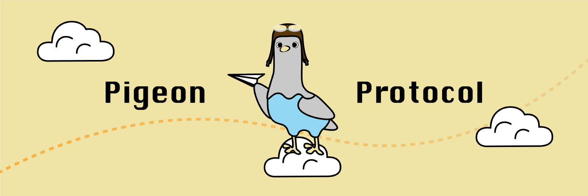

## Pigeon - The Off Grid Peer-to-Peer Protocol

 * Overview (You are Here)
 * [Frequently Asked Questions](faq.md)
 * [Roadmap](roadmap.md)
 * [Developer Docs and Specification](dev_docs.md)
 * [Ideas and Features](ideas.md)

# Who Uses Pigeon? Why?

Pigeon is used by software developers building peer-to-peer apps. It is particularly useful for peer-to-peer apps that have poor internet connectivity or no connectivity at all. Pigeon provides these developers a way to store and replicate (backup) their nodes data while eliminating the need for networks like the internet and preventing interference from malicious third parties.

Every user in the mesh has a local database. Entries in the database are cryptographically signed. Because the entries are signed, you can share your database entries anywhere (CD-R, email, public forums, [USB dead drops](https://en.wikipedia.org/wiki/USB_dead_drop)) knowing that the message has not been altered by malicious third parties.

When you "follow" a peer, you keep a backup copy of their database on your machine and update the data occasionally via the use of "bundle" files. This replicated data can then be "gossiped" to peers that need to read the data when the other peer is not available.

In summary, Pigeon is:

 * decentralized (peer-to-peer)
 * replicated by default
 * tamper and forgery resistant
 * delay tolerant and offline-first
 * built for [sneakernet](https://en.wikipedia.org/wiki/Sneakernet) from the ground up

# Use Cases and Real-World Applications

Pigeon can serve a number of use cases. Below are some examples:

 * Systems with low connectivity or uptime such as remote sensor logging, maritime systems, solar systems with intermittent power, IoT systems with poor network connectivity.
 * Store-and-forward message gateways, such as a [data mule](https://en.wikipedia.org/wiki/Data_mule).
 * Censorship resistant applications, such as peer-to-peer messaging and blogging.
 * [Delay tolerant networking](https://en.wikipedia.org/wiki/Delay-tolerant_networking)
 * Applications that require a high level of data-integrity or auditing.
 * Delay-tolerant peer-to-peer social networks, games, file sharing etc...
 * Time series data storage

Framed in a more applied sense, Pigeon could theoretically support applications and use cases such as:

 * A messenger app
 * An IoT data logger
 * A newsgroup / [NNTP](https://en.wikipedia.org/wiki/Network_News_Transfer_Protocol) analog
 * A turn-based board game
 * A microblogging social network
 * An e-commerce application for P2P cryptocurrency users
 * Secure Scuttlebutt import / export / gateway tool
 * A social mapping / point-of-interest sharing site
 * Bluetooth file sharing app
 * A GUI database browser for developers that wish to use the protocol for log storage or as a time series DB
 * Sync files over actual pigeons, possibly soliciting help from world famous boxer and pigeon racing enthusiast Mike Tyson

## Help Wanted

If you wish to become involved with protocol development, there are a few areas we need help in currently. Email us for more information.

 * Documentation editors, proof readers and feedback. The feedback really matters. Please email me your opinions and ideas. I will reply to all messages.
 * We need real-world applications to be built using the protocol! We are happy to assist you along the way.
 * We need a BNF grammar for Pigeon messages.

## Implementations

There is currently one working implementation available [here](https://tildegit.org/PigeonProtocolConsortium/pigeon_ruby).
A long term goal is to support all major platforms and languages.

## Prior Art

Pigeon borrows many of the ideas set forth by the [Secure Scuttlebutt protocol](https://ssbc.github.io/scuttlebutt-protocol-guide/). It is my opinion that SSB is one of the most innovative protocols created in recent years. Without the research and efforts of the [Secure Scuttlebutt Consortium](https://github.com/ssbc), this project would not be possible, so a big thanks goes out to all the people who make SSB possible.

I've also been inspired by the compactness and minimalism of [SQLite, which should serve as a role model for all of us](https://www.sqlite.org/talks/wroclaw-20090310.pdf).

In many ways, this protocol can be considered an amalgam of the best ideas from both SQLite and Secure Scuttlebutt.

Pigeon also borrows the [Lipmaa link concept seen in the Bamboo protocol](https://github.com/AljoschaMeyer/bamboo) to allow for partial verification of message feeds.

## How Pigeon Differs from Traditional Sneakernet

[Sneakernet](https://en.wikipedia.org/wiki/Sneakernet) is a protocol used by ancient civilizations to exchange files between computers with limited internet connectivity. Although Pigeon protocol messages can be exchanged over sneakernet, Pigeon is _not_ sneakernet. Sneakernet messages by themselves are not tamper resistant, nor do they provide redundant backup via peers. In contrast, a Pigeon protocol message is redundantly replicated _beyond_ its intended recipient to neighboring peers ("friend of a friend") via gossip and uses cryptography to guarantee that a message's content has not been altered by a third party.

In summary, Pigeon protocol offers benefits above what a traditional sneakernet can provide. A Pigeon protocol message:

 * Is automatically backed up by peers and peers-of-peers (gossip).
 * Cannot be forged by malicious parties.
 * Cannot be altered by anyone except the author.

## How Pigeon Differs From Secure Scuttlebutt (SSB)

As mentioned, Pigeon was inspired mostly by the work of Secure Scuttlebutt. Pigeon takes a different approach in a few areas, however.

1. No reliance on networking in the core library. Although SSB is theoretically able to support Sneakernet-only operation, it is difficult in practice due to reliance on UDP, TCP, and in the case of pubs, DNS.
1. Pigeon uses a custom key/value serialization format instead of JSON. This has two benefits:
    * Serialization and signing is much simpler. Indentation and whitespace are less likely to cause verification problems.
    * Unlike JSON, pigeon messages do not allow nesting, which promotes simplified message schemas.
1. Pigeon uses Crockford flavored Base32 rather than URL safe Base64. This makes it easier to support old or low powered systems and is easier to support FAT16 / embedded systems.
1. Pigeon was designed for portability from the beginning. It has a small enough conceptual overhead that it will actually be possible to support platforms other than NodeJS. Complicated features (like network support) are ignored in favor of an easy-to-implement standard
1. It uses Lipmaa links, so you can verify a feed without downloading all messages. This was inspired by the work of the Bamboo protocol.


## How Does It Work?

Each node in a swarm of peers has a local "log". The log is an append only feed of messages written in an ASCII-based serialization format. Messages are signed with a secret key to validate a message's integrity and to prevent tampering by malicious peers. Nodes in the swarm "follow" other logs from peers of interest. Nodes always replicate the logs of their peers and "gossip" information about peers across the swarm. Gossip information is packaged into "bundles" which contain backups of peer logs in an efficient  format that can be easily transmitted via sneakernet, direct serial connection, or any high throughput medium, regardless of latency.

Log synchronization via Sneakernet is the main use case for Pigeon messages to be transmitted. SD Cards sent via postal mail offer an excellent medium for transmission of Pigeon messages, although any data transfer medium is theoretically possible.


## What Messages Look Like

Messages use a custom ASCII-based encoding scheme (shown below). Although they are mostly human readable, they are intended to be parsed by third party applications rather than written by hand.

Example 1:

```
author @78V80T9Q7862GW5KTNGSDBKMSA53WE98G8TGFDS6HC9HEABFD64G.ed25519
kind ba16b9f6-a0bc-44e4-b873-da52308186e8
prev %KDKK65CX8GMV7EFCJ4K3J77T38SNDE6DX1TE7AKKGW7X74Z63WKG.sha256
depth 0
lipmaa 0

hello:"World"
this_is_a:"Key"

signature JSSFBAZ58Y73NPWZ912KYS0EZ1WA3V3FAG9VW2TF99B3Z0RH06Q52DS2AEBRPEZJFZWBA1Q4WYR7N19VVGRZ9KDFYAX64PCTA9BEW3G.sig.ed25519

```

Example 2:

```
author @78V80T9Q7862GW5KTNGSDBKMSA53WE98G8TGFDS6HC9HEABFD64G.ed25519
kind b049f082-861f-43f0-bc10-ca97b2b91b2e
prev NONE
depth 1
lipmaa 0

cool_message:%KDKK65CX8GMV7EFCJ4K3J77T38SNDE6DX1TE7AKKGW7X74Z63WKG.sha256

signature X4KF6YM3YMR457VTJ7HGY92F6W65YQBEG3WS5QDFNSAF45KHMDZZZRWK710F04Y6TPM2AJ3W135RSF42V8DAE7MJSSTCHYP7JQG7E10.sig.ed25519
```


## Protocol Maturity

The [first working implementation of a Pigeon protocol client](https://tildegit.org/PigeonProtocolConsortium/pigeon_ruby) is complete. We are temporarily halting feature development to focus on documentation, bug fixes and outreach. Contact us to get involved.

## Constraints and Design Philosophy

 * Offline-first means offline-only. Never incorporate TCP or UDP features ever. Such concerns must be handled by higher-level protocols or by application developers. This is to ensure that the protocol is always a viable option for off-grid use cases.
 * Natural is better than simple. Convention over configuration. Do not make plugins for common use cases unless it would hurt portability.
 * Prefer a monolithic internal structure. Avoid external dependencies except for limited use cases (Eg: crypto libs). Do not break things into smaller pieces until there are at least three real-world reasons to do so. Decoupling a library into a package for only 2 use cases is not acceptable.
 * Maintain ecosystem diversity by having a protocol that can be easily and entirely ported to new languages and platforms.
 * No singletons. No signing authorities, no servers of any kind, even locally, no differentiation between peers (eg: no "super peers").
 * Configuration is always a design compromise. We will allow a limit of 10 configuration options for all eternity. These are simple key/value pairs. No nesting, no namespacing, no dots, no dashes, no nested config names, no arrays, none of that crap. Seriously, I'm watching you.
 * Assume CPU and RAM are not plentiful.
 * Assume platform has no networking support. No servers. No hooks for startup, shutdown, or reboot.
 * Assume block storage is plentiful when making resource allocation tradeoffs.
 * Files are better than sessions, but be filesystem agnostic. Persistence mechanisms are implementation-specific.
 * Provide tamper resistance. Privacy features will be added later.
 * Enable "Free listening"
 * Have a formal specification (reference implementations are not OK).
 * Minimize conceptual overhead (If it's not needed at least 80% of the time, don't add it).
 * Use a serialization format that is deterministic and easy to parse on constrained devices.
 * Backwards compatibility. Numerous compromises have been made to support legacy systems, such as devices that lack network support and FAT16 file systems.

## Non-Goals

 * Networking support: The protocol will make no mention of TCP, UDP, SSH, HTTP, Etc..
 * Configurability: Configuration is the root of all evil. Instead of trying to create something that serves every use case, focus on >80% use cases and allow edge cases to be handled by application developers.
 * Anonymity: Though pseudonymity is possible via the use of multiple identities, the concept of anonymity is not well suited to this protocol. Every message is signed by a known identity, though identities are easily created and can be backed by pseudonyms for privacy.
 * (OPEN TO DISCUSSION) Encryption. Like many internet protocols, encryption concerns are offloaded to the transport layer. Consider using an encrypted file system or encrypted compression application to store data. If you have ideas on how we could support encryption, please contact us. Please keep in mind that anonymity is not necessarily a project goal.

# Up Next

This concludes the overview. To learn more, continue to [frequently asked questions](faq.md)