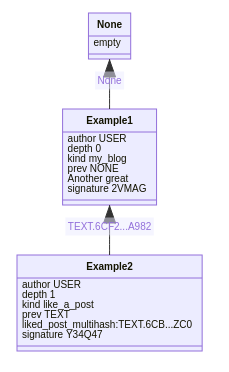

# The Pigeon protocol

The Pigeon protocol is an off-grid, serverless, peer-to-peer protocol
for building software that works on poor internet connections, or
entirely offline.

# Table of contents

- [Introduction](#introduction)
- [Why build software that follows the Pigeon protocol?](#why-build-software-that-follows-the-pigeon-protocol)
- [How does the Pigeon protocol benefit users?](#how-does-the-pigeon-protocol-benefit-users)
    - [Data is backed up by default](#data-is-backed-up-by-default)
    - [Data can be shared anywhere](#data-can-be-shared-anywhere)
    - [Data is tamper-resistant](#data-is-tamper-resistant)
    - [Data is always available](#data-is-always-available)
- [Use-case scenarios](#use-case-scenarios)
- [Software implementation ideas](#software-implementation-ideas)
- [Implementations](#implementations)
- [How does the Pigeon protocol work?](#how-does-the-pigeon-protocol-work)
- [What do Pigeon messages look like as data?](#what-do-pigeon-messages-look-like-as-data)
- [Constraints and Design Philosophy](#constraints-and-design-philosophy)
- [What the Pigeon protocol is not trying to address](#what-the-pigeon-protocol-is-not-trying-to-address)
- [How the Pigeon protocol differs from Sneakernet](#how-the-pigeon-protocol-differs-from-sneakernet)
- [How the Pigeon protocol differs From Secure Scuttlebutt](#how-the-pigeon-protocol-differs-from-secure-scuttlebutt)
- [Influences](#influences)
- [Getting involved with the Pigeon protocol development](#getting-involved-with-the-pigeon-protocol-development)
- [For more information](#for-more-information)

# Introduction

This document will describe why you may want to build software that
follows the Pigeon protocol, how the protocol works, and how you can
write software that follows this protocol.

This document provides a reference to the Pigeon protocol
specifications, and is written for developers.

# Why build software that follows the Pigeon protocol?

Software that follows the Pigeon protocol can operate online or
offline, regardless of connectivity quality. This allows you to focus
on software development, instead of worrying about network types and
quality, or third-party services.

# How does the Pigeon protocol benefit users?

The Pigeon protocol outlines several ways users can benefit from using
software that follows this protocol.

This section consists of the following subsections:

- [Data is backed up by default](#data-is-backed-up-by-default)
- [Data can be shared anywhere](#data-can-be-shared-anywhere)
- [Data is tamper-resistant](#data-is-tamper-resistant)
- [Data is always available](#data-is-always-available)

## Data is backed up by default

Software that follows the Pigeon protocol allows users to store data
on their nodes, and copy their data to other nodes. By copying data to
other nodes, this not only backs up data, but also provides users with
data they can access offline.

## Data can be shared anywhere

Every user in the mesh has a local database. You can share your
database entries anywhere, such as CD-R, email, public forums, and
[USB dead drops](https://en.wikipedia.org/wiki/USB_dead_drop).

## Data is tamper-resistant

Entries in the database are cryptographically signed. Because the
entries are signed, you don't have to worry about malicious third
parties tampering with your data.

## Data is always available

Any data the user is currently accessing is already available offline,
and in case of a sudden internet outage, or poor connectivity issues,
the access to the data is not affected, because the data doesn't rely
on an internet connection.

You can "follow" peers, by copying their database to your
machine. Updates are performed by retrieving newer bundles from your
peers. This allows you to share your peers' bundles on behalf of
them. This is useful when the peer is unavailable and another peer
wants their bundle.

The act of sharing peers' data on behalf of other peers is called
"gossiping".

# Use-case scenarios

The Pigeon protocol may be useful in scenarios such as:

* Systems with low connectivity or uptime such as remote sensor
  logging, maritime systems, solar systems with intermittent power,
  IoT systems with poor network connectivity.
* Store-and-forward message gateways, such as a
  [data mule](https://en.wikipedia.org/wiki/Data_mule).
* Censorship resistant applications, such as peer-to-peer messaging
  and blogging.
* [Delay tolerant networking](https://en.wikipedia.org/wiki/Delay-tolerant_networking)
* Applications that require a high level of data-integrity or
  auditing.
* Delay-tolerant peer-to-peer social networks, games, file sharing
  etc...
* Time series data storage

# Software implementation ideas

* A messenger application
* An IoT data logger
* A newsgroup or [NNTP](https://en.wikipedia.org/wiki/Network_News_Transfer_Protocol) analog
* A turn-based board game
* A microblogging social network
* An e-commerce application for P2P cryptocurrency users
* A Secure Scuttlebutt import / export / gateway tool
* A social mapping / point-of-interest sharing site
* A Bluetooth file sharing application
* A graphical database browser for developers that want to use the
  protocol for log storage or as a time series database
* A synchronization system over actual pigeons, possibly soliciting
  help from the world-famous boxer and pigeon-racing enthusiast, Mike
  Tyson

# Implementations

There is currently one working implementation available
[here](https://tildegit.org/PigeonProtocolConsortium/pigeon_ruby).
A long term goal is to support all major platforms and languages.

# How does the Pigeon protocol work?

Each node in a social network of peers has a local "log". The log is an
append-only feed of messages written in an ASCII-based serialization
format.

Messages are signed with a secret key to validate a message's
integrity and to prevent tampering by malicious peers.

Nodes in the social network "follow" other logs from peers. Nodes replicate the
logs of their peers and "gossip" information about peers across the
social network.

Gossip information is packaged into "bundles" which contain backups of
peer logs in a format that can be transmitted through sneakernet,
direct serial connection, or any high-throughput medium, regardless of
latency.

Log synchronization through Sneakernet is the main use case for Pigeon
messages to be transmitted. SD Cards sent via postal mail offer an
excellent medium for transmission of Pigeon messages, although any
data transfer medium is possible.


# What do Pigeon messages look like as data?

Pigeon messages use a custom ASCII-based encoding scheme, as seen in
**Example 1** and **Example 2** below.

**Note**: Although the message encoding scheme is human-readable the
messages should be parsed by third-party applications rather than
written by hand.

**Example 1**:

```
author USER.R68Q26P1GEFC0SNVVQ9S29SWCVVRGCYRV7D96GAN3XVQE3F9AZJ0
depth 0
kind my_blog
prev NONE

current_status:"Another great day. Nice weather, too!"

signature 2VMAG4SCX5RHVBKCB1RNZCB0AJN4WN6FEMS7W9FM1CVYSZXMX7CPQFCDPYEKCTGG91Y1YSGY4G5K8XAGQ67HEPDFRMRYQHWQBATAC2R

```

**Example 2**:

```
author USER.R68Q26P1GEFC0SNVVQ9S29SWCVVRGCYRV7D96GAN3XVQE3F9AZJ0
depth 1
kind like
prev TEXT.6CBA4J3756A5SNM1W1GHNCTT9EG95ZP3ZMAT5Z1EJP7TXMNNVZC0

liked_post_multihash:TEXT.6CBA4J3756A5SNM1W1GHNCTT9EG95ZP3ZMAT5Z1EJP7TXMNNVZC0

signature Y34Q47V0BY370RM5KWGRJRN9HFNGJN0C3DEYVB2V2476CW9RN5HD4XD7KMQ6T4T42N36R5P3XX6E3FYEWVZR25AVCF6KQPZHJP6EM10

```



For examples of how messages are handled, see the Ruby-implementation tutorial
[here](https://tildegit.org/PigeonProtocolConsortium/pigeon_ruby/src/branch/master/ruby_tutorial.md)

# Constraints and Design Philosophy

 * Offline-first means offline-only. Never incorporate TCP or UDP
   features. TCP- or UDP-related concerns must be handled by
   higher-level protocols or by application developers. This is to
   ensure the protocol is always an option for off-grid usage.

   <!-- I wasn't sure what the "do not make ... unless it would hurt portability" meant below -->
 * Natural is better than simple. Convention over configuration. Do
   not make plugins for common use cases unless it would hurt
   portability.

 * Prefer a monolithic internal structure. Avoid external dependencies
   except for limited use cases (Eg: crypto libs). Do not break things
   into smaller pieces until there are at least three real-world
   reasons to do so. Decoupling a library into a package for only 2
   use cases is not acceptable.

 * Maintain ecosystem diversity by having a protocol that can be
   easily and entirely ported to new languages and platforms.

 * No singletons. No signing authorities, no servers of any kind, even
   locally, no differentiation between peers (eg: no "super peers").

 * Configuration is always a design compromise. We will allow a limit
   of 10 configuration options for all eternity. These are simple
   key/value pairs. No nesting, no namespacing, no dots, no dashes, no
   nested config names, no arrays, none of that crap. Seriously, I'm
   watching you.

 * Assume CPU and RAM are not plentiful.

 * Assume platform has no networking support. No servers. No hooks for
   startup, shutdown, or reboot.

 * Assume block storage is plentiful when making resource allocation
   trade-offs.

 * Files are better than sessions, but be filesystem
   agnostic. Persistence mechanisms are implementation-specific.

 * Provide tamper resistance. Privacy features will be added later.

 * Enable "Free listening"

 * Have a formal specification (reference implementations are not OK).

 * Minimize conceptual overhead (If it's not needed at least 80% of
   the time, don't add it).

 * Use a serialization format that is deterministic and easy to parse
   on constrained devices.

 * Backwards compatibility. Numerous compromises have been made to
   support legacy systems, such as devices that use FAT16 file systems or lack network support.

# What the Pigeon protocol is not trying to address

* Networking support: The protocol will make no mention of TCP, UDP,
  SSH, HTTP, Etc..
* Configurability: Configuration is the root of all evil. Instead of
  trying to create something that serves every use case, focus on
  over 80% use cases and allow edge cases to be handled by
  application developers.
* Anonymity: Though pseudonymity is possible via the use of multiple
  identities, the concept of anonymity is not well suited to this
  protocol. Every message is signed by a known identity, though
  identities are easily created and can be backed by pseudonyms for
  privacy.
* OPEN TO DISCUSSION: Encryption. Like many internet protocols,
  encryption concerns are offloaded to the transport layer. Consider
  using an encrypted file system or encrypted compression application
  to store data. If you have ideas on how we could support encryption,
  please contact us. Please keep in mind that anonymity is not
  necessarily a project goal.

# How the Pigeon protocol differs from Sneakernet

[Sneakernet](https://en.wikipedia.org/wiki/Sneakernet) is a protocol
used by ancient civilizations to exchange files between computers with
limited internet connectivity.

Although the Pigeon protocol messages can be exchanged over
sneakernet, the Pigeon protocol is _not_ sneakernet. Sneakernet
messages by themselves are not tamper-resistant, nor does it provide
redundant backup using peers.

In contrast, a Pigeon protocol message is redundantly replicated
_beyond_ its intended recipient to neighboring peers, "a friend of a
friend", through gossip. Unlike sneakernet, the Pigeon protocol also
uses cryptography to guarantee that a message's content has not been
altered by a third party.

# How the Pigeon protocol differs From Secure Scuttlebutt

[Secure Scuttlebut](https://scuttlebutt.nz/) is a decentralized,
peer-to-peer protocol that also works offline.

The Pigeon protocol does not rely on networking in the core
library. Although Secure Scuttlebutt is able to support
Sneakernet-only operation, it is difficult in practice due to reliance
on UDP, TCP, and in the case of
[pubs](https://github.com/ssbc/ssb-server/wiki/Pub-Servers), DNS.

The Pigeon protocol uses a custom key/value serialization format
instead of JSON. This has two benefits:

* Serialization and signing is more simple, because indentation and
  whitespace are less likely to cause verification problems.
* Unlike JSON, pigeon messages do not allow nesting, which promotes
  simplified message schemas.

The Pigeon protocol uses Crockford-flavored Base32 rather than URL
safe Base64. This makes it easier to support old or low-powered
systems and is easier to support FAT16 or embedded systems.

Unlike Secure Scuttlebutt, the Pigeon protocol was designed for
portability and simplicity. It allows support for platforms that
aren't limited to NodeJS.

Complicated features, such as network support, are ignored in favor of
an easy-to-implement standard.

# Influences

Pigeon borrows many of the ideas set forth by the
[Secure Scuttlebutt protocol](https://ssbc.github.io/scuttlebutt-protocol-guide/).
It is my opinion that SSB is one of the most innovative protocols
created in recent years. Without the research and efforts of the
[Secure Scuttlebutt Consortium](https://github.com/ssbc)
, this project would not be possible, so a big thanks goes out to all
the people who make SSB possible.

I've also been inspired by the compactness and minimalism of
[SQLite, which should serve as a role model for all of us](https://www.sqlite.org/talks/wroclaw-20090310.pdf).

In many ways, this protocol can be considered an amalgam of the best
ideas from both SQLite and Secure Scuttlebutt.

# Getting involved with the Pigeon protocol development

**PIGEON PROTOCOL DEVELOPERS MAILING LIST:** Send an email with "subscribe" in the subject line to `pigeon_developers@vaporsoft.xyz`.

If you want to be involved with the Pigeon protocol development, there
are areas we need help in currently:

* Documentation, editors, and feedback.
* We need applications to be built using the protocol! We are happy to
  assist you along the way.
* We need a BNF grammar for Pigeon messages.

Your feedback really helps. Feel free to email me your opinions and
ideas at `contact at vaporsoft.xyz`. I will reply to all messages.

# For more information

Check out the following links:

* [Message Format Specification](message_format.md)
* [Bundle Format Specification](dev_docs.md)
* [Frequently Asked Questions](faq.md)
* [Roadmap](roadmap.md)
* [Ideas and Features](ideas.md)

TODO:

 * Explain what forking is and why it is not supported.
 * Explain how verification happens (Soapdog)
 * Question: "How do apps find what they need in the Pigeon feeds and/or accumulate state forward? Is this the responsibility of the Pigeon libraries, or do apps do it themselves?"
