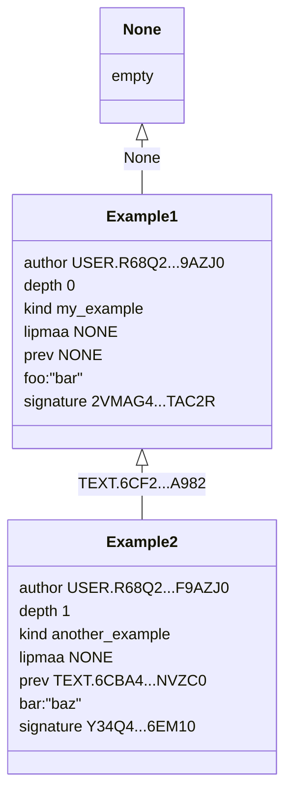

Edit this diagram at https://mermaid-js.github.io/mermaid-live-editor/#/edit

```mermaid
classDiagram
	None <|-- Example1: None
	Example1 <|-- Example2: TEXT.6CF2...A982

  class None{
    empty
  }

	class Example1{
    author USER.R68Q2...9AZJ0
    depth 0
    kind my_example
    lipmaa NONE
    prev NONE

    foo:"bar"

    signature 2VMAG4...TAC2R
	}

	class Example2{
    author USER.R68Q2...F9AZJ0
    depth 1
    kind another_example
    lipmaa NONE
    prev TEXT.6CBA4...NVZC0

    bar:"baz"

    signature Y34Q4...6EM10
	}
```