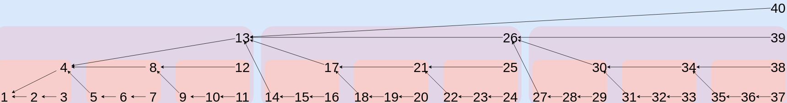

# Exploring the Pigeon Message Format

In the test that follows, we will explore a pigeon message line-by-line.

The example message is shown in its entirety below:

```
author USER.4CZHSZAH8473YPHP1F1DR5ZVCRKEA4Q0BY18NMXYE14NZ0XV2PGG
depth 123
kind weather_report
lipmaa TEXT.7ZKXANAAM31R9AMHMBVGP9Q5BF5HSCP557981VQHBTRYETGTGAK0
prev TEXT.E90DY6RABDQ2CJPVQHYQDYH6N7Q46SZKQ0AQ76J6D684HYBRKE4G

temperature:"22.0C"
webcam_photo:FILE.FV0FJ0YZADY7C5JTTFYPKDBHTZJ5JVVP5TCKP0605WWXYJG4VMRG
weather_reported_by:USER.GGP2VX0ZN41EYXMN81YB0Q4AEKRCVZ5RD1F1PHPY3748HAZSHZC4

signature JSPJJQJRVBVGV52K2058AR2KFQCWSZ8M8W6Q6PB93R2T3SJ031AYX1X74KCW06HHVQ9Y6NDATGE6NH3W59QY35M58YDQC5WEA1ASW08
```

### Pigeon Multihashes and Data Types

Pigeon has 4 data types:

 * Blob multihash: Used to identify arbitrary binary files mentioned in a feed. Blob multihashes start with the word `FILE.`, followed by a Base32 hash (SHA256).
 * Message multihash: Used to reference a message in someone's feed. Starts with the word `TEXT.` followed by a Base32 SHA256 checksum.
 * User multihash: Used to reference a particular feed. Starts with the word `USER.` followed by a base32 encoded ED25519 public key.
 * String: Information shorter than 128 characters can be wrapped in "double quotes" and placed directly into messages. Larger strings must be converted to blobs. The byte length of a character is determined by the client's chosen text encoding scheme. Pigeon has no official text encoding, but UTF-8 is highly encouraged in scenarios where interoperability is important. One character always one character, even if it is multi-byte. Strings cannot contain whitespace characters (encoding dependent). The protocol does not implement character escaping (eg: `"\n"`). Please start a discussion on the mailing list if your application requires this feature.
 * None: The word "NONE" is used to indicate the absence of data, similarly to `null` or `nil` seen in some programming languages.

### Parts of a Message

The three parts of a Pigeon message are:

1. Header: Data that is used by the _protocol_
2. Body: Data that is used by the _user or application_
3. Footer: Cryptographic signature to prevent tampering or forgery.

**The parts of a message must follow the order specified in this document.** The order of headers is not user definable. The fact that headers are alphabetical is a coincidence and future versions of the protocol might not be alphabetized.

### Parts of a Header

A header is the first part of a message and contains 5 subsections. Each of these sections will be explained in further detail in the sections that follow:

 1. `author`: A user multihash indicating the author of the message. The public key will be used to verify the signature (found in the footer)
 1. `depth`: The order number of the current message. Since feeds are append-only, this number will only increase. The `depth` field ensures unique message signatures, even for successive duplicate messages.
 1. `kind`: Used by applications to determine the intent or "shape" of a message.
 1. `lipmaa`: A [lipmaa link](https://github.com/AljoschaMeyer/bamboo#links-and-entry-verification). Points to a previous message multihash in the same feed that is computed using a [special function](https://kodu.ut.ee/~lipmaa/papers/thesis/thesis.pdf). Some day, this will allow for partial verification of feeds. The field is currently required and verified for correctness, but it is not used in any clients.
 1. `prev`: The multihash of the previous message in the feed. Required for verifying the authenticity of a feed.


**Header entries must follow the order specified above.**

### Line 1: `Author`

EXAMPLE:

```
author USER.4CZHSZAH8473YPHP1F1DR5ZVCRKEA4Q0BY18NMXYE14NZ0XV2PGG
```

The first line of a Pigeon message header is the `author` entry.

Every Pigeon database has an "identity". An identity is an ED25519 key pair that prevents tampering by parties other than the database owner. In the example above, the identity multihash was `USER.4CZHSZAH8473YPHP1F1DR5ZVCRKEA4Q0BY18NMXYE14NZ0XV2PGG`.

The steps to generate a valid identity are:

1. Perform [Crockford Base32 encoding](https://www.crockford.com/base32.html) on an ED25519 public key.
2. Concatenate the characters `USER.` to the beginning of the string from step 1.

### Line 2: `Depth`

EXAMPLE:

```
depth 3
```

Pigeon messages exist in a linear sequence which only moves forward and never "forks", skips or moves backward.
Every message has a `depth` field to indicate its "place in line".
Because every message has an ever-increasing integer that never duplicates, every message in a Pigeon feed will have a unique hash. This is true even if messages have identical body content.

The `depth` count always starts at 0 and icreases by 1 every time a new message is added to the feeds. Feeds that assign `depth` values in a non-sequential order are invalid. Eg: No gaps, no skipping, etc..

### Line 3: `Kind`

EXAMPLE:

```
kind weather_report
```

The second line of the header is the `kind` entry. This entry is user definable. The `kind` entry is used as a means of signalling intent to applications that will consume the message.

It must meet the following criteria:

 * Must be 1-90 characters in length
 * Cannot contain whitespace or control characters
 * May contain any of the following characters:
    * alphanumeric characters
    * dashes (`-`), underscores (`_`) and dots (`.`)

**For the first message of a feed, this value is set to `NONE`.**

Message multihashes are calculated as follows:

1. Create a [Crockford base 32](https://www.crockford.com/base32.html) sha256 hash of the message's content.
2. Append the string `TEXT.` to the front of the checksum created in step 1.

### Line 4: `Lipmaa`

This concept was borrowed from the [Bamboo protocol](https://github.com/AljoschaMeyer/bamboo#links-and-entry-verification) and [Helger Lipmaa's thesis](https://kodu.ut.ee/~lipmaa/papers/thesis/thesis.pdf).

The `lipmaa` field (often called a "Lipmaa Link") is a special kind of `prev` field that allows partial verification of feeds. This field makes it possible to verify a single message (or subset of messages) without downloading the entire chain of messages.



The `lipmaa` field is calculated using the function below. If the function returns an integer, the lipmaa link for the given message is the message multihash of the message with that depth. For example, if the function returns 17, the `lipmaa` will contain the multihash of message number 17 in the current feed:

```ruby
    def lipmaa(n)
      # The original lipmaa function returns -1 for 0
      # but that does not mesh well with our serialization
      # scheme. Comments welcome on this one.
      if n < 1 # Prevent -1, division by zero etc..
        return nil
      end

      m, po3, x = 1, 3, n
      # find k such that (3^k - 1)/2 >= n
      while (m < n)
        po3 *= 3
        m = (po3 - 1) / 2
      end
      po3 /= 3
      # find longest possible backjump
      if (m != n)
        while x != 0
          m = (po3 - 1) / 2
          po3 /= 3
          x %= m
        end
        if (m != po3)
          po3 = m
        end
      end
      result = n - po3
      if result == n - 1
        return nil
      else
        return result
      end
    end
```

### Line 5: `Prev`

EXAMPLE:

```
prev TEXT.E90DY6RABDQ2CJPVQHYQDYH6N7Q46SZKQ0AQ76J6D684HYBRKE4G
```

A Pigeon message feed is a unidirectional chain of documents where the newest document points back to the document that came before it in the chain ([example diagram](diagram1.png)).

To create this chain, a Pigeon message uses the `prev` field. The `prev` field contains a message multihash. In this case, the multihash is `TEXT.E90DY6RABDQ2CJPVQHYQDYH6N7Q46SZKQ0AQ76J6D684HYBRKE4G`.

Messages are content addressed. This is in contrast to protocols such as HTTP which use names to identify resources. Because Pigeon messages are addressed by content rather than by name, changing a message's content, even by just one character, has the effect of completely changing the message's multihash.


### Line 6: Body Start (Empty Line)

Once all headers are added, a client must place an empty line (`\n`) after the header.
The empty line signifies the start of the message body.

Some notes about body entries:

 * The body of a message starts and ends with an empty line (`\n`).
 * Every body entry is a key value pair. Keys and values are separated by a `:` character (no spaces).
 * A message may not exceed 128 key/value pairs.
 * A key must be 1-90 characters in length.
 * A key cannot contain whitespace or control characters
 * A key only contains the following characters (`[A-Z|a-z|\-|\_|\.|0-9]{1,90}`):
    * alphanumeric characters (a-z, A-Z, 0-9)
    * dots (`.`)
    * dashes (`-`)
    * underscores (`_`)
 * A value may be a:
   * A string (128 characters or less)
   * A multihash referencing an identity (`USER.`), a message (`TEXT.`) or a blob (`FILE.`).

### Lines 7: Example Entry Containing a String

EXAMPLE:

```
temperature:"22.0C"
```

Body entries are defined by the user and contain key/value pairs of application-specific data.
When a key/value pair represents something other than an identity, blob or message ID, a string is used.
Strings can be used for any type of data that does not fit into the other three categories.
Strings must be less than or equal to 128 characters in length.
The example above is the most simple kind of body entry. It specifies an arbitrary string representing the current temperature.

The protocol does not dictate the format of strings (ie: there is no 1st class JSON support). The meaning and formatting of a string is the responsibility of the application.

### Lines 8: Entry Referencing a Blob

EXAMPLE:

```
webcam_photo:FILE.FV0FJ0YZADY7C5JTTFYPKDBHTZJ5JVVP5TCKP0605WWXYJG4VMRG
```

Applications may attach files to messages in the form of blobs. Blobs are referenced using a blob multihash.

A blob is referenced in a message's key or value. A client will include a blob's content in a "bundle" (explained later). This ensures that a feed's peers get a copy of the file that a message references.

### Lines 9: Entry Referencing a Peer's Identity

EXAMPLE:

```
weather_reported_by:USER.GGP2VX0ZN41EYXMN81YB0Q4AEKRCVZ5RD1F1PHPY3748HAZSHZC4
```

A message may reference other identities (or its own identity) by using an identity multihash either in the key or value portion of the entry.

This is analogous to "social tagging" seen in many social networks.

### Lines 10: Empty Carriage Return (Footer Start)

The last part of a message is the footer. Like a message body, a message footer starts and ends with an empty line.
The footer is essential for ensuring the tamper resistant properties of a Pigeon message.

### Lines 11: Signature Line

EXAMPLE:

```
signature JSPJJQJRVBVGV52K2058AR2KFQCWSZ8M8W6Q6PB93R2T3SJ031AYX1X74KCW06HHVQ9Y6NDATGE6NH3W59QY35M58YDQC5WEA1ASW08
```

A signature starts with the word `signature` followed by a space.
After that, the body and header (including the trailing `\n`) are signed using the author's ED25519 key.
The signature is encoded with Crockford base 32.
An empty carriage return is added after the signature line.
